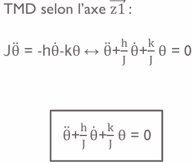

# TIPE
# Mise en situation
Dans le cadre de ma formation en classe préparatoire aux grandes écoles, j'ai été amené à travailler sur un volant à retour élastique.  
J’ai choisi d’étudier l’impact des vibrations internes sur le comportement d’un volant de jeu en mouvement. Ces dispositifs embarquent souvent des moteurs associés à des masses excentrées, qui génèrent des vibrations destinées à améliorer l’immersion.  

L’objectif de ce travail a été de modéliser le comportement dynamique d’un volant lorsqu’il est relâché depuis une certaine position angulaire, en prenant en compte les effets des vibrations.
# Problématique retenue
Comment des vibrations peuvent influencer le comportement d’un volant de jeu en plein mouvement ?  
# Objectif du TIPE
L’objectif de ce projet est d’analyser l’impact des vibrations internes sur la position d’un volant de jeu lorsqu’il est relâché depuis un certain angle.  
Dans un premier temps, il s’agira de modéliser le comportement du volant perturbé par les vibrations, afin de reproduire son mouvement en conditions simulées.  
Ce modèle sera ensuite comparé au comportement réel observé expérimentalement.  
L’étude permettra ainsi de quantifier l’écart entre la simulation et la réalité, et d’évaluer l’influence des vibrations sur le retour à l’équilibre du volant.  
# Etude expérimentale 
Caractéristiques du volant :  
- Rotation du volant de -135° à 135° (270° d’angle de rotation)
- Diamètre du volant 280 mm

Caractéristiques des vibreurs :
- Vibreur 1 :
  - Poids 25
  - Tension nominale 5V
  - Courant nominale 150 mA
  - Vitesse de rotation 2550 tr/min
- Vibreur 2 :
  - Poids 28g
  - Tension nominale 5V
  - Courant nominale 150 mA
  - Vitesse de rotation 2550 tr/min
 

Caractéristiques de l'accéléromètre : 
- Arduino Uno (3.3V, GND, SCL ,SDL)
- MPU6050

Acquisition du mouvement du volant avec un oscilloscope par le biais d’un potentiomètre.

# Résultat de l'étude expérimentale

D’après les résultats obtenus avec et sans vibrations lors de l’acquisition, on constate que ces dernières ont peu voire aucun impact significatif sur le mouvement du volant.

# Etude théorique

Pour l'étude théorique, on se propose de partir sur le modèle cinématique simple suivant composé d'une liaison pivot comprenant en son sein un ressort.

Étude du volant :

# Résultat de l'étude théorique

# Résultat de simulation python

